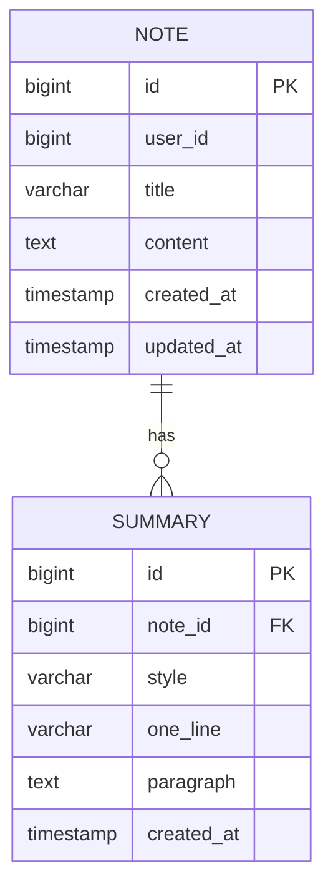

# ERD – AI 요약 노트

> 핵심 테이블 2개만 사용. 인증은 실제로 구현하지 않고 요청 헤더의 `X-USER-ID` 값을 숫자로 저장해 구분합니다.

## 테이블 개요

### notes
| 컬럼        | 타입           | 제약                          | 설명                         |
|------------|----------------|-------------------------------|------------------------------|
| id         | BIGSERIAL      | PK                            | 노트 식별자                  |
| user_id    | BIGINT         | NOT NULL                      | 요청 헤더의 사용자 ID        |
| title      | VARCHAR(200)   | NOT NULL                      | 제목                         |
| content    | TEXT           | NOT NULL                      | 본문(Markdown 허용)          |
| created_at | TIMESTAMP      | NOT NULL, DEFAULT now()       | 생성 시각                    |
| updated_at | TIMESTAMP      | NOT NULL, DEFAULT now()       | 수정 시각(저장 직전 갱신)    |

### summaries
| 컬럼         | 타입           | 제약                                  | 설명               |
|-------------|----------------|---------------------------------------|--------------------|
| id          | BIGSERIAL      | PK                                    | 요약 식별자        |
| note_id     | BIGINT         | FK → notes.id, NOT NULL               | 요약 대상 노트     |
| style       | VARCHAR(20)    | NOT NULL                              | `brief`/`detailed` |
| one_line    | VARCHAR(300)   | NOT NULL                              | 한 줄 요약         |
| paragraph   | TEXT           | NOT NULL                              | 문단 요약          |
| created_at  | TIMESTAMP      | NOT NULL, DEFAULT now()               | 생성 시각          |

## 관계
- `notes (1)` — `summaries (N)`  
- 한 노트에 여러 요약이 생성될 수 있음(가장 최근 것을 화면에 노출)

## 권장 인덱스
- `CREATE INDEX idx_notes_user_title ON notes(user_id, title);`
- `CREATE INDEX idx_summaries_note_created ON summaries(note_id, created_at);`

## Mermaid ER


## 간단한 DDL
```
  CREATE TABLE notes (
  id BIGSERIAL PRIMARY KEY,
  user_id BIGINT NOT NULL,
  title VARCHAR(200) NOT NULL,
  content TEXT NOT NULL,
  created_at TIMESTAMP NOT NULL DEFAULT NOW(),
  updated_at TIMESTAMP NOT NULL DEFAULT NOW()
);

CREATE TABLE summaries (
  id BIGSERIAL PRIMARY KEY,
  note_id BIGINT NOT NULL REFERENCES notes(id),
  style VARCHAR(20) NOT NULL,
  one_line VARCHAR(300) NOT NULL,
  paragraph TEXT NOT NULL,
  created_at TIMESTAMP NOT NULL DEFAULT NOW()
);

-- 권장 인덱스
CREATE INDEX idx_notes_user_title ON notes(user_id, title);
CREATE INDEX idx_summaries_note_created ON summaries(note_id, created_at);
```